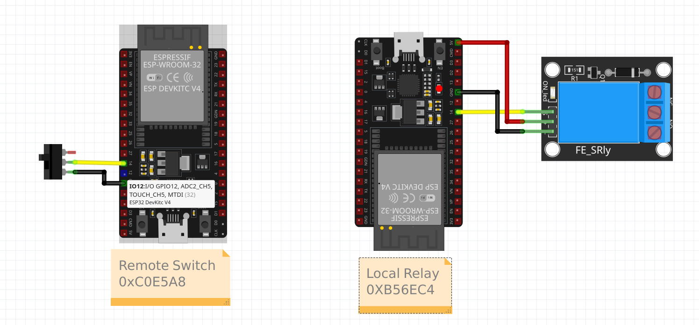

# Remote switch

## Introduction

In this example we will use EspMeshMesh to remotely control a relay on the second device from a switch connected on the first device.



## Finding address and hash

Set `remote_node_addr` to the address of the relay device. This is the last three bytes of its MAC address (for example MAC `AA:BB:CC:DD:EE:FF` becomes `0xDDEEFF`).

Set `remote_hash` to the hash of the relay switch entity. On the relay device boot logs, `meshmesh_direct` prints the hash for each entity, like `Found switch Local relay with hash 1234ABCD`. Use the last 4 hex digits (lower 16 bits) for `remote_hash` (for example `0xABCD`).

## Local relay

Configuration of the device connected to the relay.

```yaml
external_components:
  - source: github://EspMeshMesh/esphome-meshmesh@main

esphome:
  name: local-relay
  friendly_name: Local relay

esp32:
  board: esp32dev
  framework:
    type: esp-idf

socket:
  implementation: meshmesh_esp32

logger:
  level: INFO
  baud_rate: 115200

mdns:
  disabled: True

api:
  reboot_timeout: 0s

ota:
  platform: esphome

meshmesh:
  baud_rate: 0
  rx_buffer_size: 0
  tx_buffer_size: 0
  password: !secret meshmesh_password
  channel: 3
  use_starpath: True

meshmesh_direct:

switch:
  - platform: gpio
    name: "Local relay"
    pin: GPIO14
```

## Remote control

Configuration of the device connected to the switch.

```yaml
substitutions:
  remote_node_addr: 0xb56ec4
  remote_hash: 0x0000

external_components:
  - source: github://EspMeshMesh/esphome-meshmesh@main

esphome:
  name: remote-control
  friendly_name: Remote control

esp32:
  board: esp32dev
  framework:
    type: esp-idf

socket:
  implementation: meshmesh_esp32

logger:
  level: INFO
  baud_rate: 115200

mdns:
  disabled: True

api:
  reboot_timeout: 0s

ota:
  platform: esphome

meshmesh:
  baud_rate: 0
  rx_buffer_size: 0
  tx_buffer_size: 0
  password: !secret meshmesh_password
  channel: 3
  use_starpath: True

meshmesh_direct:

binary_sensor:
  - platform: gpio
    name: "Remote button"
    pin:
      number: GPIO14
      mode:
        input: true
        pullup: true

switch:
  - platform: meshmesh_direct
    name: "Remote relay"
    address: ${remote_node_addr}
    target: ${remote_hash}
```